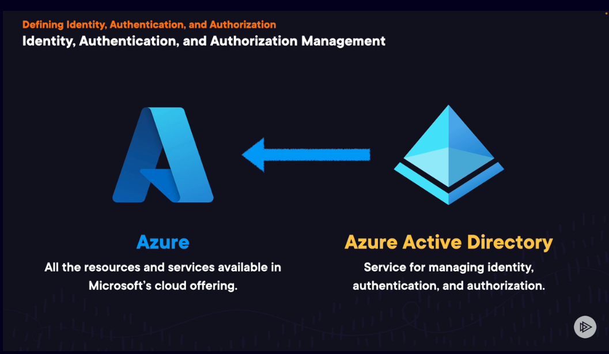
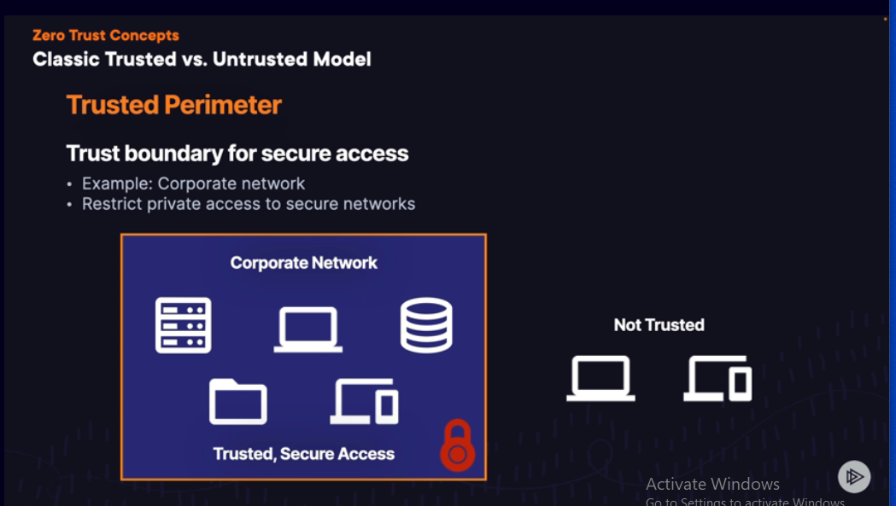
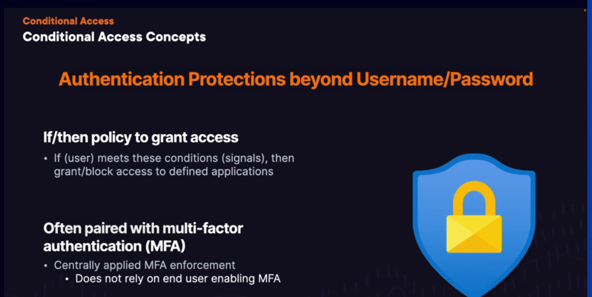
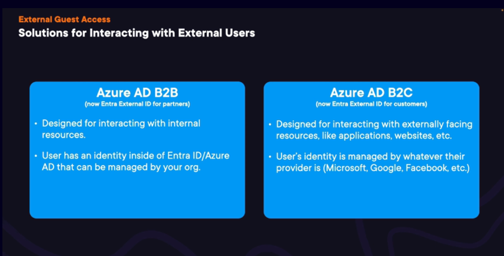
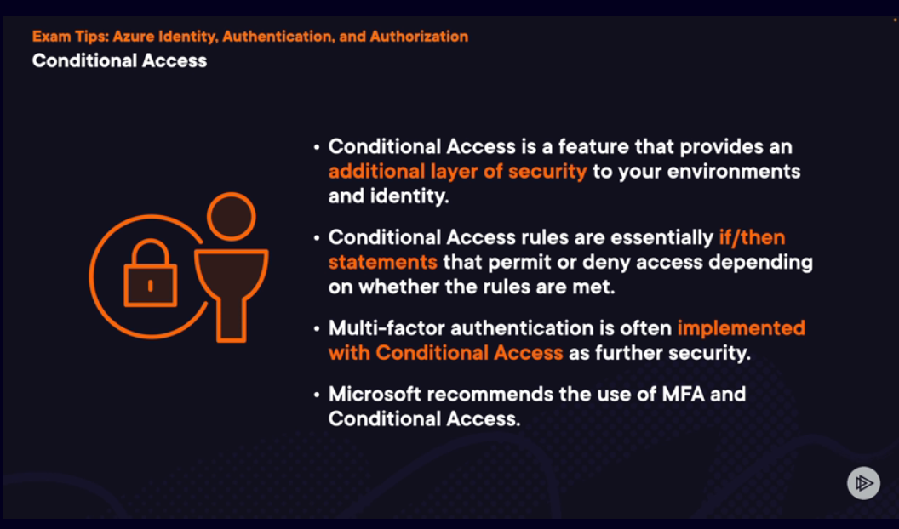

# AZURE

## Scope

- ### Defining Identity, Authentication & Authorization

- ### Azure Active Directory

1.  Azure Active directory is NOT Active Directory
2.  Actve Directory is NOT Microsoft Entra ID (Azure active Directory)

- ### Zero Trust Concepts

- ### Multi-Factor Authentication

- ### Conditional Access

- ### Passwordless Authentication

- ### External Guest Access

- ### Azure Active Directory Domain Services

- ### Managing Access to Resources with Role-BAsed Access Control (RBAC)

- ### Revisiting defense in depth

- ### Tips

- ### Interacting with Azure Using Azure Resource Manager

- ### Understanding Azure Portal

- ### Azure CLI

- ### Azure Powershell

- ### Acessing Azure CLoud Shell

- ### Azure ARM Templates

- ### Conclusion

